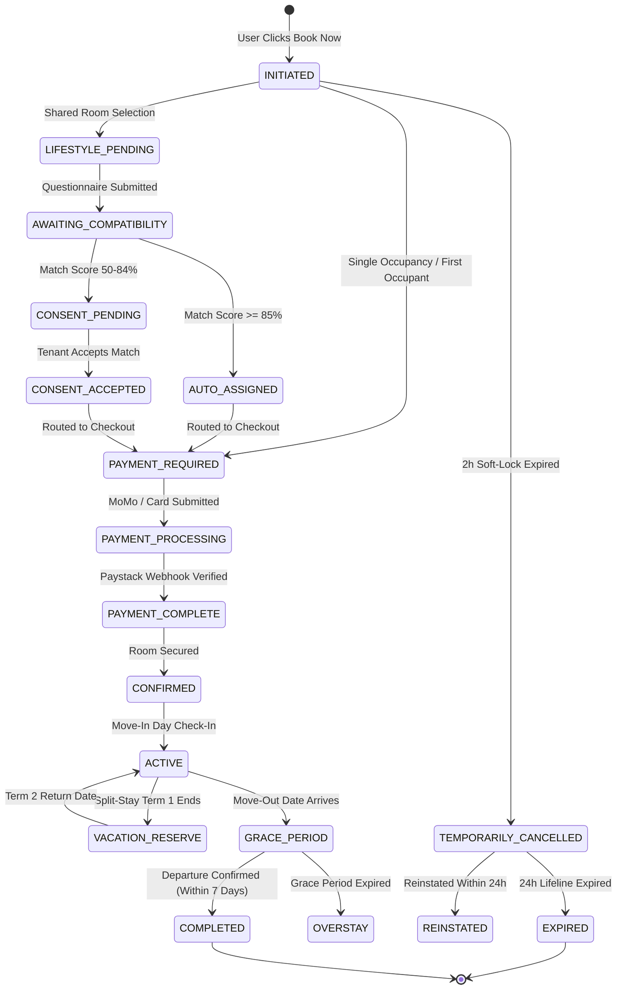
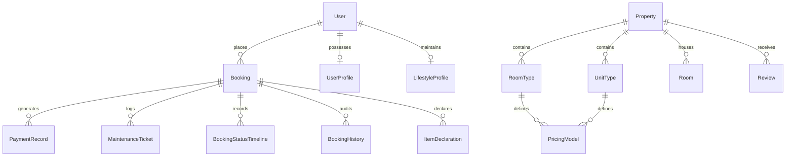

# ROOMORA
## The Complete Technical, Architectural & Theoretical Master Specification
**Official Master Architecture & System Blueprint • Version 4.0 (Comprehensive Edition)**

---

### Executive Metadata

| Parameter | Value |
| :--- | :--- |
| **Platform Name** | Roomora Accommodation Platform (StayMatch Engine) |
| **Architecture Framework** | Django 5.x / Python 3.14 / PostgreSQL / Capacitor Native PWA |
| **Production URL** | `https://roomora-production-cab4.up.railway.app` |
| **GitHub Repository** | `roomora00-web/Roomora` (Branch: `new-main`) |
| **Target Ecosystem** | Higher-Education Student Housing & Young-Professional Sanctuaries |

---

## Table of Contents
1. [Executive Overview & System Philosophy](#1-executive-overview--system-philosophy)
2. [User Roles, Identity & Security Ecosystem](#2-user-roles-identity--security-ecosystem)
3. [Property Discovery, Geospatial Intelligence & Listing Brochures](#3-property-discovery-geospatial-intelligence--listing-brochures)
4. [Dual-Class Property Architecture & Inventory Mechanics](#4-dual-class-property-architecture--inventory-mechanics)
5. [Atomic Concurrency Control & Continuous 2-Hour Soft Lock](#5-atomic-concurrency-control--continuous-2-hour-soft-lock)
6. [Flexible Tenancy Structures, Billing Models & Academic Mathematics](#6-flexible-tenancy-structures-billing-models--academic-mathematics)
7. [The 8-Dimension Algorithmic Roommate Compatibility Engine](#7-the-8-dimension-algorithmic-roommate-compatibility-engine)
8. [The 17-State Booking Lifecycle State Machine](#8-the-17-state-booking-lifecycle-state-machine)
9. [Financial Architecture, Payment Gateways & Escrow Security](#9-financial-architecture-payment-gateways--escrow-security)
10. [The Room Portal & In-Stay Operating System](#10-the-room-portal--in-stay-operating-system)
11. [Departure Logistics, Grace Periods & Automated Overstay Mechanics](#11-departure-logistics-grace-periods--automated-overstay-mechanics)
12. [Reputation Engine, Verified Reviews & Quality Assurance](#12-reputation-engine-verified-reviews--quality-assurance)
13. [System Architecture, Database Schemas & Mobile/PWA Infrastructure](#13-system-architecture-database-schemas--mobilepwa-infrastructure)
14. [Conclusion & Architectural Roadmap](#14-conclusion--architectural-roadmap)

---

## 1. Executive Overview & System Philosophy

Roomora is not a conventional classifieds listing board or passive directory. It is an end-to-end, state-driven **Accommodation Operating System** engineered specifically to resolve the severe systemic failures prevalent in higher-education and young-professional housing markets. 

In emerging university ecosystems, student accommodation is traditionally plagued by:
- **Predatory Middlemen & Unofficial Agents**: Exorbitant non-refundable viewing fees.
- **Bait-and-Switch Photography**: Physical properties drastically misaligned with digital advertisements.
- **Random / Toxic Roommate Allocations**: Communal living friction leading to distress and academic dropouts.
- **Opaque Billing**: Hidden utility charges, arbitrary rate hikes, and unreturned security deposits.
- **Chaotic Move-Out Logistics**: Untracked overstays, informal key handovers, and zero departure accountability.

Roomora replaces informal verbal commitments with an uncompromising, mathematically sound **17-state finite-state machine**, backed by atomic inventory locking, multi-factor compatibility matching, transparent escrow financial settlement, and continuous stay telemetry.


---

## 2. User Roles, Identity & Security Ecosystem

The platform is governed by a secure, multi-tiered user architecture designed to uphold community trust, physical safety, and financial integrity.

### 2.1 Role Definitions & Separation of Concerns

| Role Tier | Primary Responsibilities | Governance & Permissions |
| :--- | :--- | :--- |
| **Students / Tenants** | Register, complete academic/ID verification, browse listings, complete 26-metric lifestyle questionnaires, execute payments, manage in-stay residency via the Room Portal, log maintenance tickets, declare appliances, and submit verified reviews. | Consumer permissions. Strictly restricted to their own bookings, profiles, and authenticated room telemetry. |
| **Platform Administrators** | Exclusively onboard, inspect, and publish property listings; verify landlord credentials; configure pricing matrices and room tiers; arbitrate tenant disputes; review compatibility overrides; track overstays; and authorize escrow disbursements. | Full operational staff permissions. Direct access to master controls, escrow ledgers, and inventory audits. |
| **Landlords / Property Owners** | Passive stakeholders. Landlords **DO NOT** create or edit public listings directly (preventing unverified claims). They access a dedicated dashboard to view occupancy, receive tenant assignments, review maintenance tickets, and accept escrow payouts. | Restricted partner permissions. Read-only access to assigned tenant names, emergency contacts, and payout ledgers. |

### 2.2 Identity & Academic Verification Pipeline
To maintain a trusted community and enforce property restrictions (e.g., *Student-Only* or *Gender-Segregated* dormitories):
1. **Government ID / Student ID Upload**: Tenants submit official documentation (Passport, Ghana Card, Student Identification).
2. **Academic Institution Binding**: Applicants select their accredited institution (e.g., University of Ghana, KNUST, UPSA, Ashesi).
3. **Academic Level & Study Field**: Level 100 to 400 or Post-Graduate specialization.
4. **Admin Clearance**: Verification badges are granted upon administrative audit.

### 2.3 Security Infrastructure & Rate Limiting
- **256-Bit Cryptographic Encryption**: All web and mobile endpoints operate strictly over TLS/HTTPS.
- **Email OTP Verification**: 6-digit Time-Based One-Time Passwords (OTP) expiring in 15 minutes, with a maximum of 3 failed attempts.
- **Brute-Force Rate Limiter**: The `LoginAttempt` subsystem monitors failed authentication events. Exceeding 5 failed attempts triggers an automatic 30-minute lockout (`locked_until`).
- **CSRF Tokens & Secure Session Cookies**: Evaluated cryptographically on every modifying POST/PUT request.

---

## 3. Property Discovery, Geospatial Intelligence & Listing Brochures

### 3.1 Multi-Parameter Search Engine
Prospective tenants query live inventory across multiple dimensions:
- **Budget Brackets**: Min/Max price boundary filtering in Ghanaian Cedis (GH₵).
- **Property Classifications**: Hostels vs. Entire Apartments vs. Studio Sanctuaries vs. Shared Flats.
- **Geospatial Coordinates**: Distance-to-campus calculations based on latitude/longitude coordinates.
- **Gender-Segregation Filters**: Co-ed, Boys Only, and Girls Only configurations.
- **Granular Amenity Checklist**: Generator backup (Dumsor protection), Borehole water, High-speed WiFi, Air Conditioning, Private Bathrooms, Study Desks, and Balconies.

### 3.2 Rich Listing Profiles
Every property serves as a transparent digital brochure:
- **Verified Photography**: Physically inspected room, bathroom, and common area galleries.
- **Explicit House Rules**: Disclosed curfew hours, guest policies, smoking/alcohol rules, and noise regulations prior to reservation.
- **Roomora Verification Seal**: Visual proof of legal ownership and safety compliance.
- **Verified Tenant Reviews**: Unfiltered ratings from residents who completed stays.

---

## 4. Dual-Class Property Architecture & Inventory Mechanics

Roomora enforces a strict conceptual divergence between communal student living and private residential sanctuaries:

```
                  ┌───────────────────────────────┐
                  │    ROOMORA PROPERTY ENGINE    │
                  └───────────────┬───────────────┘
                                  │
         ┌────────────────────────┴────────────────────────┐
         ▼                                                 ▼
┌─────────────────────────────────┐       ┌─────────────────────────────────┐
│     HOSTELS (Communal Living)   │       │   APARTMENTS (Private Sanctuary)│
├─────────────────────────────────┤       ├─────────────────────────────────┤
│ • Tracked by Bed / Slot         │       │ • Tracked by Whole Unit         │
│ • Gender-Segregation Rules      │       │ • No Roommate Matching          │
│ • 8-Dimension Roommate Matching │       │ • Monthly / Annual Calendar     │
│ • Semester (17 Wk) Cycles       │       │ • Self-Service Lease Extensions │
│ • Split-Stay & Vacation Reserve │       │ • Private Residential Terms     │
└─────────────────────────────────┘       └─────────────────────────────────┘
```

| Feature Dimension | Hostels & Communal Dorms | Apartments & Private Units |
| :--- | :--- | :--- |
| **Inventory Unit** | Tracked by **Slots / Beds** within a Room | Tracked as a **Whole Unit** (Studio, 1-Bed, 2-Bed) |
| **Roommate Matching** | **Active**: 8-dimension lifestyle compatibility engine | **Disabled**: Single unified leaseholder |
| **Billing Terminology** | Academic Stay, Semester Rate, Vacation Reserve | Lease Term, Monthly Rent, Lease Extension |
| **Billing Model** | Semester (17 Wks), Full Academic Year (34 Wks) | Monthly (30 Days), Annual (52 Weeks) |
| **Holiday Break Option** | **Option B (Split-Stay)**: Zero rent during vacation | Continuous full-term lease |

---

## 5. Atomic Concurrency Control & Continuous 2-Hour Soft Lock

### 5.1 The Atomic Soft-Locking Theorem
In high-demand student room drops, traditional listing platforms suffer from race conditions leading to double-booking collisions. Roomora eliminates this via `SoftLockService`:
1. The database row for the chosen Room or UnitType is locked using PostgreSQL `SELECT FOR UPDATE`.
2. The system validates that `available_slots > 0`.
3. A `Booking` record is instantiated in `INITIATED` status, assigning `soft_lock_expires_at = now() + 2 hours`.
4. Pending slots increment and available slots decrement atomically.
5. The slot becomes completely invisible to other browsing students.

### 5.2 Continuous Single 2-Hour Countdown Lifecycle
Roomora enforces a continuous 2-hour window across the entire checkout journey:
- The countdown begins when clicking **"Book Now"**.
- The timer persists across Duration Selection, Lifestyle Questionnaire, and Confirmation Review.
- When reaching the payment gateway, `PaymentRecord.payment_window_closes_at` inherits the exact remaining time from the soft lock, preventing artificial timer resets.

---

## 6. Flexible Tenancy Structures, Billing Models & Academic Mathematics

| Tenancy Model | Standard Duration | Billing Formula | Target Use Case |
| :--- | :--- | :--- | :--- |
| **Option A: Full Academic Year (Continuous)** | 34 Weeks (238 Consecutive Days) | $\text{Total} = \text{Semester Price} \times 2$ | Continuous residency without leaving for holidays. |
| **Option B: Split-Stay (Vacation Reserve)** | Semester 1 (17 Wks) + Break + Semester 2 (17 Wks) | $\text{Total} = \text{Sem 1 Rate} + \text{Sem 2 Rate}$ (Zero rent during holiday gap) | Students vacating during long holidays. Room locked in `VACATION_RESERVE`, belongings secured, slot guaranteed for Term 2. |
| **Option C: Semester-Based Stay** | 17 Weeks (119 Days Canonical) | $\text{Total} = \text{Single Semester Rate}$ | Single-term or exchange students. |
| **Option D: Monthly Flex / Annual Lease** | 1 to 24 Months (Standardized 30-Day Billing) | $\text{Total} = \text{Monthly Rate} \times \text{Months}$ | Young professionals and private apartment tenants. |

### 6.1 Split-Stay Vacation Gap Mathematics
- **Semester 1**: $\text{Move-In} \rightarrow \text{Move-In} + 119\text{ Days}$ (17 Weeks).
- **Vacation Reserve**: $\text{Semester 1 End} \rightarrow \text{Semester 2 Return Date}$ (Zero rent accrued).
- **Semester 2**: $\text{Semester 2 Return} \rightarrow \text{Return Date} + 119\text{ Days}$ (17 Weeks).

---

## 7. The 8-Dimension Algorithmic Roommate Compatibility Engine

### 7.1 Weighted Multi-Tier Priority Model
The `CompatibilityService` evaluates profiles across three priority tiers:

| Priority Tier | Composite Weight | Evaluated Questionnaire Attributes |
| :--- | :---: | :--- |
| **High-Priority Tier** | **70%** | Sleep Schedule, Wake Time, Cleanliness Level (1–5), Noise Tolerance (Low–Very High), Visitor Frequency (Rarely–Frequently), Smoking Tolerance, Privacy Importance. |
| **Medium-Priority Tier** | **20%** | Study Location (In-Room vs Library), Cooking Frequency (Never, Weekly, Daily), Room Climate (Cold–Warm). |
| **Low-Priority Tier** | **10%** | Social Dynamics (Introvert vs Extravert), Food Sharing Ethics (Own Items vs Share Freely), Borrowing Items (Ask First vs Never). |

### 7.2 Scoring Formula & Decision Triaging
$$\text{Final Score} = (\text{High Avg} \times 0.70) + (\text{Medium Avg} \times 0.20) + (\text{Low Avg} \times 0.10)$$

- **Tier 1: Auto-Assignment ($\text{Score} \ge 85\%$)**: High compatibility match (`ROUTING_THRESHOLD = 85`). Auto-assigned to room, profile locked, routed to `PAYMENT_REQUIRED`.
- **Tier 2: Manual Consent Flow ($50\% \le \text{Score} < 85\%$)**: Moderate match. Anonymized profile card displayed with alignment metrics. 24h decision window to Accept or Reject.
- **Tier 3: Fallback & Admin Review ($\text{Score} < 50\%$)**: Low compatibility. System re-evaluates alternative rooms or flags for Admin mediation.

---

## 8. The 17-State Booking Lifecycle State Machine



### Complete 17-State Operational Matrix

| State Identifier | System Description | Trigger / Transition Conditions |
| :--- | :--- | :--- |
| **1. INITIATED** | Soft-lock active. Slot held for 2 hours. | User clicks 'Book Now' and acknowledges house rules. |
| **2. LIFESTYLE_PENDING** | Awaiting questionnaire completion. | User advances to lifestyle preferences for shared room. |
| **3. AWAITING_COMPATIBILITY** | Algorithm calculating compatibility scores. | Lifestyle questionnaire submitted for shared space. |
| **4. AUTO_ASSIGNED** | Matched at $\ge 85\%$ compatibility. | Optimal roommate alignment detected. |
| **5. CONSENT_PENDING** | Awaiting tenant review on 50–84% match. | Moderate alignment score generated. |
| **6. CONSENT_ACCEPTED** | Tenant accepted roommate match. | Tenant clicks 'Accept Match' on consent screen. |
| **7. ADMIN_PENDING** | Awaiting admin confirmation. | Manual assignment or special occupancy review. |
| **8. PAYMENT_REQUIRED** | Checkout session initialized. | Single unit, first occupant, or accepted match routing. |
| **9. PAYMENT_PROCESSING** | Gateway verifying transaction. | MoMo USSD push sent or Card 3D Secure submitted. |
| **10. PAYMENT_COMPLETE** | Funds secured in Escrow. | Paystack webhook confirms settlement. |
| **11. CONFIRMED** | Room officially secured. | Payment verified; digital receipt and key code generated. |
| **12. ACTIVE** | Tenant physically residing in property. | Move-in date arrives; tenant checks in via Room Portal. |
| **13. VACATION_RESERVE** | Split-stay holiday pause. Zero rent. | Semester 1 ends in Option B; student vacates for break. |
| **14. GRACE_PERIOD** | 7-day penalty-free move-out window. | Lease/semester ends; student given 7 days to pack. |
| **15. OVERSTAY** | Tenant failed to vacate post-grace period. | Grace period expires; 1.5x daily penalty accrues. |
| **16. TEMPORARILY_CANCELLED** | Soft-lock expired or payment failed. | 2-hour window collapses; 24h reinstatement lifeline active. |
| **17. PERMANENTLY_CANCELLED** | Finalized irreversible cancellation. | Reinstatement window expires or Admin authorizes refund. |

---

## 9. Financial Architecture, Payment Gateways & Escrow Security

### 9.1 Triple-Tier Cost Schedule
1. **Base Accommodation Rent**: Net rental proceeds allocated directly to the Landlord.
2. **Platform Service Fee (10%)**: Explicitly separated 10% fee (`settings.PLATFORM_FEE_PERCENTAGE`) funding property inspections, verification infrastructure, 24/7 support, and escrow operations.
3. **Refundable Security Deposit**: Held in escrow to cover damages, refundable upon verified departure.

### 9.2 Multi-Channel Gateway Integration
- **Ghana Mobile Money**: Instant USSD push for MTN MoMo, Telecel / Vodafone Cash, and AirtelTigo Money.
- **Card Processing**: Visa, Mastercard, and Verve card checkout with 3D-Secure 2.0.
- **Bank Wire Transfers**: Direct bank transfer verification with slip uploads and admin reconciliation.

### 9.3 Anti-Fraud Escrow Safeguard
Tenant funds **DO NOT** disburse to Landlords upon checkout. Funds are locked in a Safeguarded Escrow Subaccount and released **ONLY** after the student physically arrives, completes digital move-in key verification, and confirms that the accommodation matches listing specifications.

---

## 10. The Room Portal & In-Stay Operating System

Once a booking is `CONFIRMED` and `ACTIVE`, the resident manages their stay through the **Room Portal**:
- **Real-Time Stay Telemetry**: Visual meters tracking *Days Elapsed vs. Days Remaining*.
- **Digital Move-In Protocol**: Key collection countdown timers, emergency contacts, and physical condition checklists.
- **Maintenance Ticketing Subsystem**: Granular ticketing across Plumbing, Electrical, Furniture, WiFi, and Structural issues with severity tracking (Low, Medium, Urgent).
- **Personal Appliance Declarations**: Audit of high-draw appliances (Fridges, Microwaves, Cookers) for electrical load and fire safety compliance.
- **Direct Landlord Channel**: Secure access to verified landlord phone and WhatsApp channels.
- **Self-Service Tenancy Management**:
  - *Apartments*: "Manage Lease Extension" with real-time pro-rated rent calculations.
  - *Hostels*: "Update Semester 2 Return Date" for split-stay adjustments.

---

## 11. Departure Logistics, Grace Periods & Automated Overstay Mechanics

### 11.1 The 7-Day Penalty-Free Grace Period
When the Move-Out Date arrives, the booking shifts to `GRACE_PERIOD`. The resident is granted a **default 7-day penalty-free window** (`DEFAULT_GRACE_PERIOD_DAYS = 7`, configurable from 3 to 14 days) to pack, clean, and execute digital **"Confirm Departure"** (key handover).

### 11.2 Automated Overstay Penalty Accrual
If the tenant fails to confirm departure by the end of the Grace Period, the state machine triggers `OVERSTAY`:
$$\text{Daily Overstay Penalty} = (\text{Standard Daily Rate}) \times 1.5$$
- Penalties accrue daily against the tenant's ledger and security deposit.
- Exceeding 15 days in Overstay triggers immediate Administrative Escalation (`OVERSTAY_ESCALATION_DAYS = 15`).
- Platform rebooking privileges are suspended until full reconciliation.

---

## 12. Reputation Engine, Verified Reviews & Quality Assurance

Following departure confirmation, residents submit verified property reviews across 4 objective pillars:
1. **Cleanliness & Hygiene**: Common areas, water reliability, waste management.
2. **Listing Accuracy**: Physical reality vs. digital photographs and amenities.
3. **Landlord Responsiveness**: Resolution speed for maintenance tickets.
4. **Value for Money**: Quality of living standards relative to rental rates.

*Only tenants with verified, completed stays can publish reviews, preventing fake review manipulation.*

---

## 13. System Architecture, Database Schemas & Mobile/PWA Infrastructure

### 13.1 Production Technology Stack
- **Backend**: Django 5.x / Python 3.14 (Clean Architecture Service Layer).
- **Database**: PostgreSQL with row-level transactional locking and indexing.
- **Frontend**: Vanilla CSS Design System with glassmorphism tokens, zero-dependency custom JS.
- **Mobile & PWA**: Capacitor.js Native Android APK wrapper + PWA manifest and service workers.
- **Task Scheduling**: Asynchronous background workers for soft-lock expiry and overstay cron jobs.
- **Deployment**: Railway Cloud PaaS with Whitenoise static bundling and Paystack webhooks.

### 13.2 Key Database Entity Relationships



---

## 14. Conclusion & Architectural Roadmap

Roomora establishes a new benchmark in real estate technology for student and young-professional housing. By combining a 17-state finite-state machine, atomic concurrency locking, multi-dimensional compatibility matching, and escrow payment protection, Roomora completely eliminates the vulnerability, fraud, and friction historically associated with student accommodation.

### Upcoming Architectural Enhancements
- **IoT Smart-Lock Integration**: Keyless digital door unlocking synchronized with the Room Portal.
- **AI-Driven Predictive Conflict Prevention**: Machine-learning analysis of ongoing maintenance and roommate interaction logs.
- **Cross-Border Tuition-Housing Escrow**: Multi-currency international student fee and accommodation corridors.

---
*© 2026 Roomora Platform Engineering. All Rights Reserved.*
